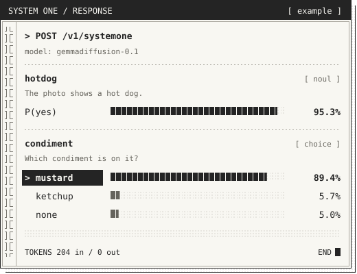

# llama-cpp-system-one

A Rust implementation of [TypeSafe AI's System One API](https://docs.typesafe.ai/introduction) for structured question answering with DiffusionGemma and [llama.cpp's DiffusionGemma PR #24423](https://github.com/ggml-org/llama.cpp/pull/24423).

This independent learning project builds on several contributions. [TypeSafe AI introduced System One models and Jev](https://typesafe.ai/blog/introducing-system-one-models-and-jev), including the state-and-questions interface and typed probabilistic answers that this API follows.

The DiffusionGemma answer-slot canvas approach used here is inspired by [OpenJev](https://github.com/razorback16/openjev#how-it-works), hosted by [Codiv](https://codiv.ai/): fix the answer template, leave unknown answer slots, and read their probability distributions in one pass. OpenJev credits its structured inference implementation to Matt Mastracci (`mmastrac`)'s [vLLM PR #57250](https://github.com/vllm-project/vllm/pull/57250) and the accompanying `structured_server.py` example.

Credit also goes to Google DeepMind for [DiffusionGemma](https://ai.google.dev/gemma/docs/diffusiongemma/model_card), and to Daniel Han (`danielhanchen`) and the llama.cpp contributors for the native DiffusionGemma support in [PR #24423](https://github.com/ggml-org/llama.cpp/pull/24423). This repository pins that work at commit [`12e0a9627d02`](https://github.com/ggml-org/llama.cpp/commit/12e0a9627d02c6395fd4bbf2aadff93d0d46a0e4). Rust handles request validation, prompt construction, and response mapping.

Run structured questions with DiffusionGemma through llama.cpp on AMD ROCm/HIP hardware. Send a state and questions; get yes/no probabilities, choices, or rubric scores through the System One API. Image questions also require a compatible vision projector.

## The masked canvas

A canvas is a block of token positions. For this API, we fix the question labels and leave one answer position per question:

```text
Prompt: state + questions + answer codes (A = yes, B = no, ...)

Canvas: Question 1       Question 2
        Answer: [ ? ]   Answer: [ ? ]
                 ^               ^
             answer slot     answer slot
```

The brackets mark unknown answers. We fill those positions with seeded random vocabulary tokens, excluding the special mask token. After caching the prompt, we evaluate the whole canvas once. Bidirectional attention lets each slot use the surrounding canvas and prompt context. We read the logits at each slot and normalize them over its allowed answer codes.

DiffusionGemma's full text generator refines a noisy canvas over multiple denoising steps. By default, this service includes an empty, closed thought channel in the prompt, takes one read with fixed surrounding text, and returns the answer distributions. It generates no thought tokens. Optional extensions add denoising steps, noise samples, a bounded thought, sequential question chunks, and images. See [diffusion and canvas inference](docs/inference.md) for the model explanation, a worked example, and the limits of these probabilities.

## Run

You need Rust 1.88+, a C/C++ compiler, CMake 3.24+, Make or Ninja, libclang, and a DiffusionGemma GGUF model. Obtain the model yourself; Cargo builds the pinned llama.cpp sources. For AMD GPUs, install ROCm/HIP and follow the [build guide](docs/build.md#rocmhip).

```bash
git submodule update --init --recursive
export DIFFUSION_MODEL="$HOME/models/diffusiongemma/diffusiongemma-26B-A4B-it-Q4_K_M.gguf"
export DIFFUSION_MMPROJ="$HOME/models/diffusiongemma/mmproj-diffusiongemma-26b-a4b-f16.gguf"

# CPU
cargo run --release --locked -p llama-cpp-system-one -- --bind 127.0.0.1:8080

# AMD GPU: after configuring ROCm/HIP
export AMDGPU_TARGETS=gfx1151
cargo run --release --locked -p llama-cpp-system-one --features hip,native -- --bind 127.0.0.1:8080

```

## Text example

With the service running, in another terminal:

```bash
curl http://127.0.0.1:8080/v1/systemone \
  -H "Content-Type: application/json" \
  --data-binary @examples/system-one.json
```

The example asks three questions about a construction material. Set `TYPESAFE_API_KEY` on the server to enable bearer authentication, then add `-H "Authorization: Bearer $TYPESAFE_API_KEY"` to client calls. The default listener is `127.0.0.1:8080`.

## Image example

For images, start the service with a compatible projector (see [image setup](docs/build.md#image-input)):

```bash
cargo run --release --locked -p llama-cpp-system-one --features hip,native -- -m "$DIFFUSION_MODEL" --mmproj "$DIFFUSION_MMPROJ"
```

Ask what’s in a photo and get structured answers:

<table>
  <tr>
    <td width="40%" align="center" valign="middle">
      
      <br><sub><strong>INPUT</strong> · Answer about the photo.</sub>
    </td>
    <td width="60%" align="center" valign="middle">
      
    </td>
  </tr>
</table>

Probabilities are rounded from the example response below; model answers can vary.

```bash
curl http://127.0.0.1:8080/v1/systemone \
  -H "Content-Type: application/json" \
  --data-binary @examples/hotdog.json
```

<details>
<summary>View the request</summary>

The image data is abbreviated here; [hotdog.json](examples/hotdog.json) contains the complete request.

```json
{
  "model": "gemmadiffusion-latest",
  "state": "Answer about the photo.",
  "images": [
    "data:image/jpeg;base64,/9j/4gJASU..."
  ],
  "questions": {
    "hotdog": {
      "type": "noul",
      "instructions": "The photo shows a hot dog."
    },
    "condiment": {
      "type": "choice",
      "instructions": "Which condiment is on it?",
      "criteria": {
        "mustard": null,
        "ketchup": null,
        "none": null
      }
    }
  }
}
```

</details>

<details>
<summary>View the full JSON response</summary>

```json
{
  "model": "gemmadiffusion-0.1",
  "answers": {
    "condiment": {
      "type": "choice",
      "choice": "mustard",
      "probabilities": {
        "ketchup": 0.056508623200352076,
        "mustard": 0.8937135408241456,
        "none": 0.04977783597550239
      },
      "confidence": 0.624854875529788
    },
    "hotdog": {
      "type": "noul",
      "noul": 0.9531962234389165
    }
  },
  "usage": {
    "input_tokens": 204,
    "output_tokens": 0
  }
}
```

</details>


Try the [hot dog photo example](docs/api.md#hot-dog-photo), including the [bundled JPEG](examples/hotdog.jpg), [ready-to-send request](examples/hotdog.json), and startup instructions for the vision projector.

Use [JavaScript SDK examples](examples/javascript/README.md) for application code. The [API reference](docs/api.md) covers request types, model aliases, and errors. Use the [extensions](docs/api.md#extensions) for `steps`, `samples`, `think`, `sequential`, and `images`. Text defaults are `steps=1`, `samples=1`, and `think=0`, with an 8,192-token context. Override the context with `--context-size`; larger contexts allocate more cache memory. Image requests require `--mmproj` or `DIFFUSION_MMPROJ`.

## Benchmarks

### JevBench public cases

On 2026-09-21, the service answered **189/231 public JevBench cases correctly (81.8%)**, with **231/231 valid responses**. We used DiffusionGemma Q4_K_M on an AMD Ryzen AI MAX+ 395 / Radeon 8060S with a HIP/native release build and the default settings: `steps=1`, `samples=1`, `think=0`, seed 42, and an 8,192-token context.

The `think=1024` rerun scored **189/231 (81.8%)**, with **231/231 valid responses**. See the [thinking comparison](benchmarks/jevbench/think1024-defaults-2026-09-21.md) and [per-case results](benchmarks/jevbench/results-2026-09-21-defaults-think1024.json).

Both local runs sent one HTTP request at a time over loopback, after one excluded warmup, with no retries. Timeouts were 120 seconds for `think=0` and 900 seconds for `think=1024`. The table compares the same 231 public case IDs. Published reference figures come from [Benchmark Heaven's pinned per-case results](https://github.com/fstandhartinger/jevbench/blob/fd51755eb0c0b546ca206d764faf3302feca913e/results/v1.2/jevbench-v1.2-per-task.json); we did not rerun those deployments.

| Model / configuration | Correct | Accuracy | p50 latency | p95 latency |
| --- | ---: | ---: | ---: | ---: |
| Jev 1.13.0 (TypeSafe AI) | 200/231 | 86.6% | 0.665 s | 0.803 s |
| djev (Maisa, diffusion-gemma) | 194/231 | 84.0% | 0.239 s | 0.354 s |
| OpenJev (DiffusionGemma 26B-A4B NVFP4, razorback16) | 189/231 | 81.8% | 0.246 s | 0.459 s |
| SemIf, formerly OpenJev (Qwen3.5-4B, TheoLeeCJ) | 187/231 | 81.0% | 0.194 s | 0.538 s |
| **Local Q4_K_M, defaults** | **189/231** | **81.8%** | **0.912 s** | **8.124 s** |
| **Local Q4_K_M, `think=1024`** | **189/231** | **81.8%** | **18.325 s** | **37.483 s** |

p50 is the median and p95 the 95th percentile, using linear interpolation over caller wall times for all attempts. Local timings include HTTP and inference but exclude model loading and the warmup. Published timings use millisecond-rounded data from deployments measured from Germany. Hardware, network paths, quantization, and inference settings differ, so this table does not isolate model speed.

These 231 public cases omit 303 decisions from the full benchmark. They do not establish an official leaderboard score or unseen-task accuracy. See the [benchmark report and reproduction commands](benchmarks/jevbench/README.md) and [per-case results and provenance](benchmarks/jevbench/results-2026-09-21-defaults.json). The [earlier baseline and thinking runs](benchmarks/jevbench/baseline-2026-09-21.md) used a 4,096-token context and remain available for historical comparison.

### System One comparison corpus

The 2026-09-21 local rerun scored **75/84 (89.3%)**, with **72/72 valid responses**, using the current inference defaults and Q4_K_M model on ROCm. Each run used the same 72 requests and 84 questions, one round, concurrency one, and no benchmark warmups or retries. Hosted TypeSafe was last measured on September 19.

| Metric | Local `gemmadiffusion-0.1`, Sep 21 | Local `gemmadiffusion-0.1`, Sep 19 | Hosted `jev-1.13.0`, Sep 19 |
| --- | --- | --- | --- |
| Question accuracy | **75/84 (89.3%)** | 65/84 (77.4%) | 80/84 (95.2%) |
| Valid responses | 72/72 | 72/72 | 71/72 |
| p50 latency, valid responses | 956.7 ms | 588.4 ms | 339.9 ms |
| p95 latency, valid responses | 2,065.8 ms | 1,314.6 ms | 881.0 ms |
| Mean latency, all attempts | 1,112.6 ms | 683.6 ms | 838.4 ms |

The local score improved by 10 questions (11.9 percentage points). These are exploratory measurements on a small synthetic corpus. The September 21 run used a newly started service without inference warmups; another local service remained loaded and machine activity was not controlled. September 19 lacks hardware and quantization provenance, so the timings do not isolate the effect of the inference changes. The historical hosted timeout counts as incorrect and contributes to its all-attempt mean. See [results and methodology](benchmarks/system-one/README.md#recorded-local-results-2026-09-21) and the [new snapshot with configuration and per-request results](benchmarks/system-one/results-2026-09-21-defaults.json).

## Documentation

| Guide | Contents |
| --- | --- |
| [Build and hardware](docs/build.md) | ROCm/WSL, CUDA, native library overrides |
| [Diffusion and canvas inference](docs/inference.md) | Denoising, answer slots, probability math |
| [HTTP API](docs/api.md) | Question types, authentication, limits, errors |
| [Development](docs/development.md) | Crate layout, tests, recipes, SCM CLI |
| [JevBench](benchmarks/jevbench/README.md) | Public benchmark results, published comparisons, reproduction commands |
| [System One comparison](benchmarks/system-one/README.md) | Synthetic corpus, local/hosted results, scoring, runner settings |
