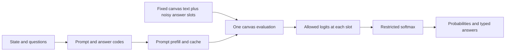

# Diffusion and canvas inference

[Back to README](../README.md)

## Text diffusion

An autoregressive language model generates one next token per decoding step. A text diffusion model predicts tokens across a block, called a **canvas**, using a sequence that starts with noise. During training, a denoising model learns to recover text from corrupted tokens. During generation, a sampler uses its predictions to refine the canvas over several steps.

A token can represent a word, part of a word, or punctuation. A canvas contains token positions, so an answer slot need not correspond to a whole word.

In masked diffusion, noise takes the form of a special mask token. DiffusionGemma uses **uniform state diffusion**: random vocabulary tokens supply the noise. Its sampler can replace uncertain tokens with fresh noise and revisit predictions as the context changes. Google describes this process in [Diffusion in Text Generation Explained](https://ai.google.dev/gemma/docs/diffusiongemma/explained).

Google built DiffusionGemma on the Gemma 4 26B A4B mixture-of-experts architecture. For full text generation, its encoder caches the prompt, and its decoder refines a 256-token canvas with bidirectional attention. After completing a block, it adds that block to the context and starts another. The [model card](https://ai.google.dev/gemma/docs/diffusiongemma/model_card) describes the full sampler and architecture.

## A restricted canvas for structured answers

Here we supply the surrounding text and reserve one token position for each answer. We use "masked canvas" to describe those unknown positions. The implementation fills them with random vocabulary tokens, excluding the special mask token.

Consider two questions about a material. For readability, this example abbreviates the prompt:

```text
Prompt
  State: Ground granulated blast furnace slag is used in concrete.
  Question 1: Is this an SCM?       A = yes, B = no
  Question 2: Which material?      A = scm, B = aggregate, C = reinforcement

Canvas before the read
  Question 1
  Answer: [random token]
  Question 2
  Answer: [random token]
```

Each bracket represents one token. The question prefixes remain fixed. The initial random tokens can come from outside the allowed answer codes.

We assign codes such as `A`, `B`, and `C` because each answer slot occupies one token. At model load, we verify that each code maps to a distinct token. Your external labels, such as `reinforcement`, can contain multiple tokens. After inference, we map codes back to those labels and restore your question IDs. The model receives numbered questions; it does not receive the IDs.



The [compiler](../crates/system-one/src/compiler.rs) constructs the prompt and slot prefixes. The [inference engine](../crates/llama-diffusion-structured/src/engine.rs), with default text options, then:

1. Wraps the prompt in DiffusionGemma's text chat markers and tokenizes it. With `think=0`, it appends an empty, closed thought channel (`<|channel>thought\n<channel|>`) to the model-turn prefill.
2. Appends fixed prefixes and one seeded random token per answer slot to the canvas.
3. Prefills the prompt cache through `PKV_PREFILL`, in chunks up to the batch size.
4. Evaluates the full canvas with one `PKV_DECODE` call.
5. Reads the allowed candidate logits at each answer position and computes probabilities.

During the canvas read, each position can attend to positions on either side and use the prompt cache. The answer slots therefore share context; they are not independent model runs. With `steps=1`, the engine returns distributions after that read. Additional steps refine noisy answer slots while preserving fixed question text and feed the previous full-canvas logits into self-conditioning. "One read" counts the canvas evaluation; prompt prefill adds work before it.

The prompt cache holds the attention keys and values computed during prefill. The decoder reuses those representations to condition its canvas predictions on the supplied state and questions.

## From logits to answers

A logit is an unnormalized score for a token. We keep the logits for the allowed answer codes and apply softmax over that set:

```text
p(i) = exp(logit(i) - max_logit) / sum_j exp(logit(j) - max_logit)
```

For example, logits `A = 2`, `B = 1` give probabilities of about `0.731` and `0.269`. These numbers illustrate the math; they are not a measured answer to the material example.

| Question type | Mapping |
| --- | --- |
| `noul` | Return the probability assigned to yes. |
| `choice` | Return the label with the largest probability and the distribution. |
| `score` | Return the expected zero-based rubric level: `sum_i i * p(i)`. |

For `choice` and `score`, we compute confidence as `1 - H(p) / ln(K)`, where `H(p) = -sum_i p(i) ln(p(i))` and `K` is the number of options. A uniform distribution gives 0; a distribution concentrated on one option gives 1. A single-option choice gives 1 by convention.

This normalization measures preference among the supplied options. It discards probability mass on other vocabulary tokens. Adding an option can change the distribution, and high entropy confidence can accompany a wrong answer. We have not calibrated these values as probabilities of correctness.

## Extensions and native integration

`steps=2..8` repeats canvas evaluation with self-conditioning from the previous step's raw vocabulary logits. The sampler uses the pinned llama.cpp entropy-bound refinement: sample low-entropy answer slots within a 0.1 entropy budget, renoise the others, and lower the sampling temperature from 0.8 toward 0.4. Fixed template tokens remain intact. Final answer probabilities always use the unscaled logits (temperature 1).

`samples=2..32` repeats the read with fresh noise and averages probabilities, then computes the choice, expected score, and confidence from that average. It does not average logits or vote over winning labels. Defaults still perform one sample; there are no automatic uncertainty rereads.

Long question lists use canvases of at most 64 tokens, split at question boundaries. Every chunk sees the full question prompt. With `sequential=true`, each later chunk also sees the earlier chunks' selected answer codes appended to the model turn. Otherwise chunks share no generated answers. All native work runs on the dedicated worker.

`think` generates a bounded internal thought in blocks of up to 64 tokens, using the pinned entropy-bound denoiser with at most 48 iterations per block. A thought delimiter or turn delimiter ends generation; reaching the requested budget force-closes the thought. The answer reads use its token IDs as additional context. The thought text is not returned or logged.

Image requests require a compatible vision-projector GGUF. Rust decodes the compressed image into RGB, and `mtmd` supplies image delimiters and projected patch embeddings. Images precede the state. The CMake wrapper builds a copy of the pinned DiffusionGemma source with two integration changes: preserve the projector's embedding scale, and allow bidirectional attention within each image prefill batch. It leaves the submodule untouched. Text prefill remains causal. Image input is not available with unpatched external shared libraries.

## Reproducibility and accounting

We seed `ChaCha8Rng` for noise and sampling. Sample seeds increment by 7919; question chunk seeds increment by 104729, with wrapping arithmetic. Matching requests and seeds reproduce initialization. Different backends and RNG implementations can produce different probabilities.

The first denoising step disables previous-step self-conditioning. Each new sample starts from fresh noise and no prior logits. The native wrapper synchronizes and clears borrowed self-conditioning pointers before returning, including on decode errors. Prompt prefill refreshes the cache before each question chunk; samples reuse that prefix.

The service keeps user text separate from special-token chat framing. Vision delimiters come from the projector tokenizer. User-supplied strings cannot inject chat control tokens.

See [limits and usage](api.md#limits-and-usage) for token accounting. `forward_ms` adds canvas evaluations, sampling, and logit transfers across reads and thoughts, excluding prompt prefill and image encoding. HTTP latency includes all work.
